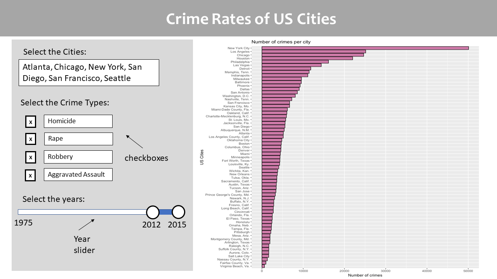
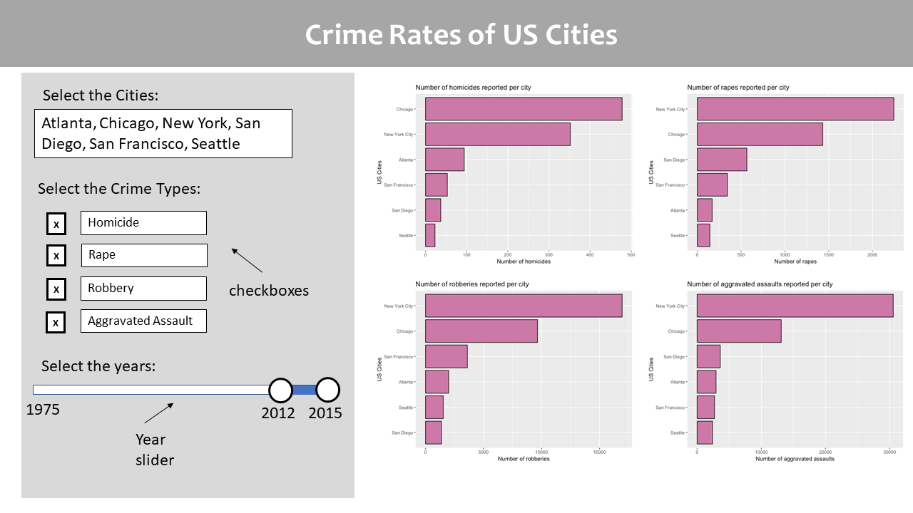

# Milestone 4 Writeup

### Changes we decided to implement:

1. Adding loading spinner for the graphs.
2. Sorting the order of bars in the graphs on "Compare your choice of cities" dashbox.
3. Making the value boxes at the top reactive.

### Reasons to choose these changes:

1. **Loading spinner**: The reason we decided to add the loading spinner is that it adds a visual aid for the user while the graphs are loading. (Some times it takes longer to wait and rather than looking at pain blank screen, user gets visual assurance that graphs are loading soon).

2. **Sorting the order of bars in the graphs**: Since the app has changed a lot since milestone 2, now we have four additional graphs present on the landing page which were not ordered yet. Ordering the graphs makes it convinient for the user to compare the least to most number of crimes very easily.

3. **Making the value boxes reactive**: The value boxes provide the user with an extact number for the selected filter. We belive it might be good for some users to look at a specific number. It might help them to form their decision for comparison between different cities.

### If we were to make the app again from scratch (or some other app in general), what would you do differently:

The app has changed with each milestone. We found ourseleves changing the whole design as we journied forward with the app. This was mainly because:
1. Shiny was new to us, we did not know the power or tools available all at once. 
2. We paid less attention to the design planning initially.

So if were to make app again or any other app in general, we would spend more time in initial planning for the design phase and overall planning all the phases, so that we spend more time on building the app rather than rolling back again to the planing of design phase.

Comparing the initial app design with final app:

| Initial Design | Final Design |
|-------|-------|
|
|  |

### Greatest challenges you faced in creating the final product

1. Interactivity between the filters.
2. Reactivity for selected filters.
3. Flexibility of design choices. ( As a whole we sttrugled to change the app design with each milestone.)

