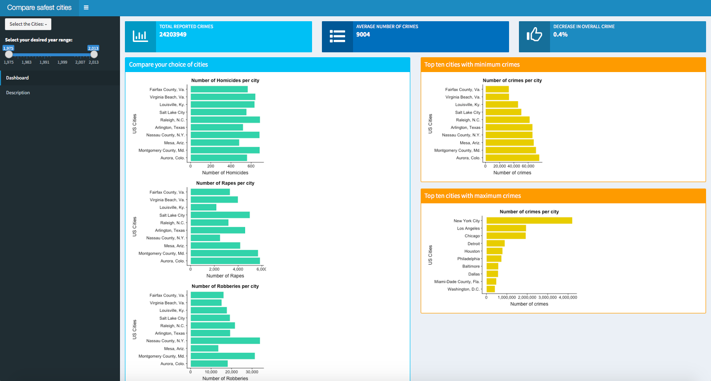

# Marshall violent crimes

The repository is for building a shiny app using Marshall violent crime data set to compare crime rates in 68 cities of the United States.

**Date:** 2019-01-12

**License:** [MIT](https://opensource.org/licenses/MIT)

#### Authors

| Name | Github |
| ---- | -------|
| Akansha Vashisth |[akanshaVashisth](https://github.com/akanshaVashisth)|
| Daniel Lin | [danielglin](https://github.com/danielglin)|

**Dataset:** [Marshall project](https://github.com/themarshallproject/city-crime)

[Link to App](https://akanshav.shinyapps.io/crime_new/)

#### Feedback to Other Groups
- https://github.com/UBC-MDS/Mental_Health_Issue_Tracker/issues/14
- https://github.com/UBC-MDS/Wine_Visualization_and_Analysis_Phuntsok_Jessie/issues/16

#### Citation

Image source : [fighting crime](http://fightingcrimenc.com/index.php/2017/09/23/fighting-crime/)

