# Functionality

On the landing page, the app will show by default the number of all violent crimes for the ten cities with the most violent crime from 1975-2013.  
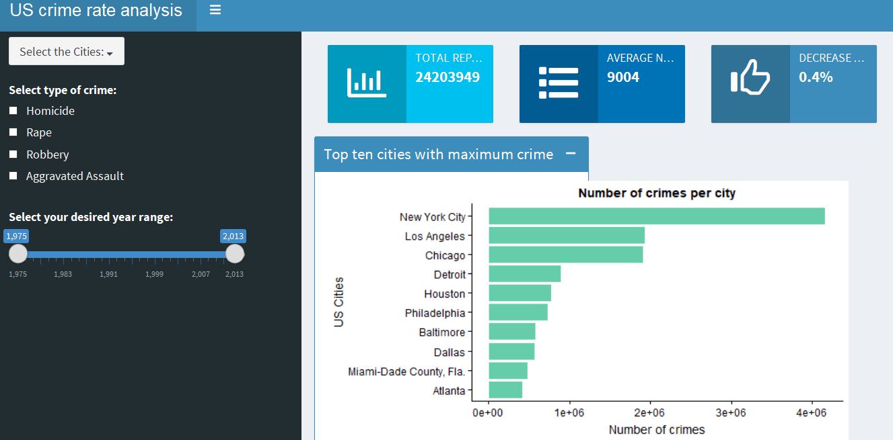

As the user makes selections on the left-hand panel, the graph will update to match the selections.
## Selecting Cities

By selecting cities using the checkboxes in the dropdown menu in the upper-left, the user can graph crime statistics for whatever city the user desires.  
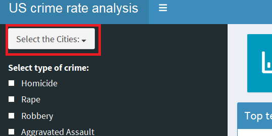

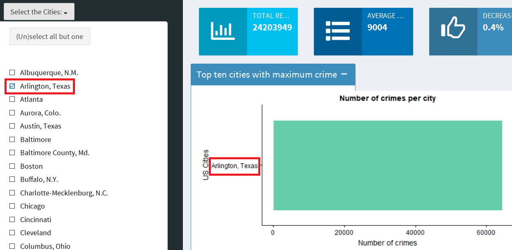

The user can also choose to just look at the top ten cities.  

The graph on the right side of the app will update to reflect the cities selected.

Currently, the "(Un)select all but one" button does not yet work.
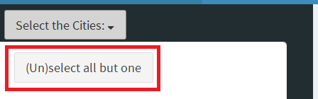

## Breaking Down By Type of Crime

The user can select one or more types of crime from the following: homicide, rape, robbery, and aggravated assault.  
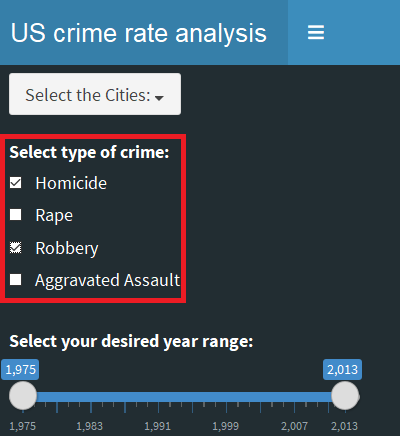

After checking boxes, the app will no longer display the overall number of crimes and instead show one graph for each crime type.  For example, selecting homicide and rape will cause the app to show one graph for homicide and one for rape.
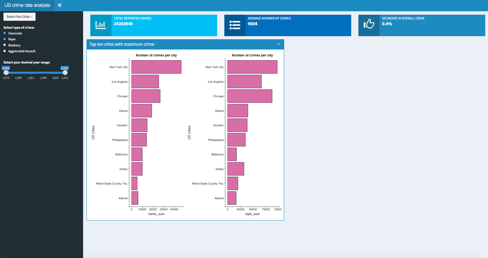

Unselecting all the boxes will cause the app to show a graph with the overall number of crimes again.

## Selecting a Time Period

To filter the graph on a specific time period, the user can use the slider on the left.  To change the starting year, click and drag the left-most button along the slider.  To change the ending year, click and drag the right-most button.
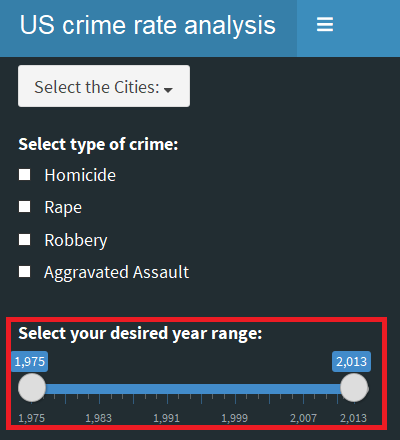

## Displaying Different Parts of the Interface

To hide the left-side panel, click the hamburger menu button (looks like three horizontal lines) in the upper-left corner.  
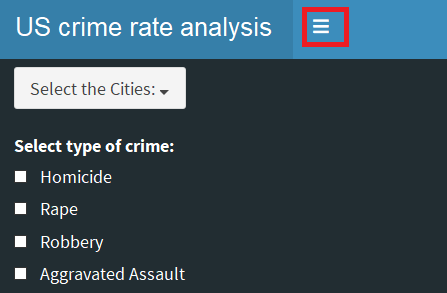

To unhide the panel, click the hamburger button again.
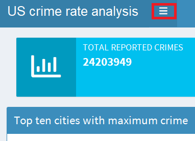

To hide the graph, click the minus button.  
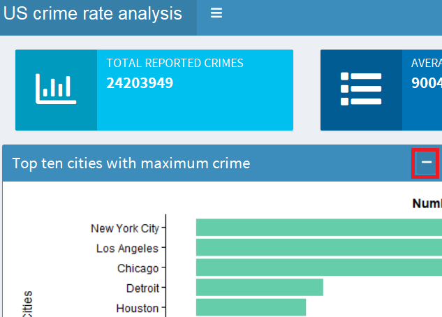

To unhide the graph, click the plus button.
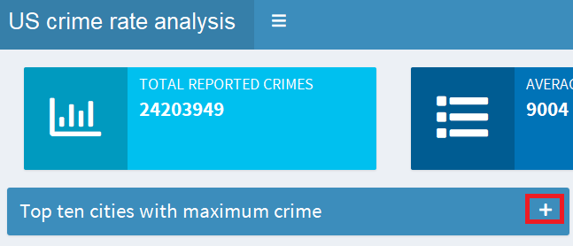
